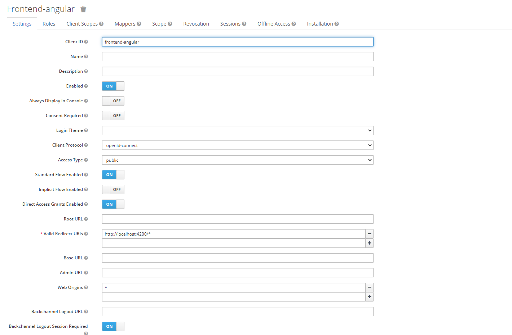

# Angular 14, NgRx, Keycloak and Angular Material Starter

This is a start project.

## Keycloak configuration

Create a client in your keycloak with public access type `public`:




Keycloak configuration is under `app.moudle.ts`:


```typescript

function initializeKeycloak(keycloak: KeycloakService) {
  return () =>
    keycloak.init({
      config: {
        url: 'https://sso.openexl.com/auth/',
        realm: 'license-server-dev',
        clientId: 'frontend-angular'
      },
      initOptions: {
        onLoad: 'check-sso',
        silentCheckSsoRedirectUri:
          window.location.origin + '/assets/silent-check-sso.html'
      }
    });
}

```

You can try login with this user `jake@jake.com` and password is `1`.

If you are lucky, that user is still valid. If not, try setting up your own keycloak server.

Have fun building apps!


Checkout my website [Datmt](https://datmt.com/)
